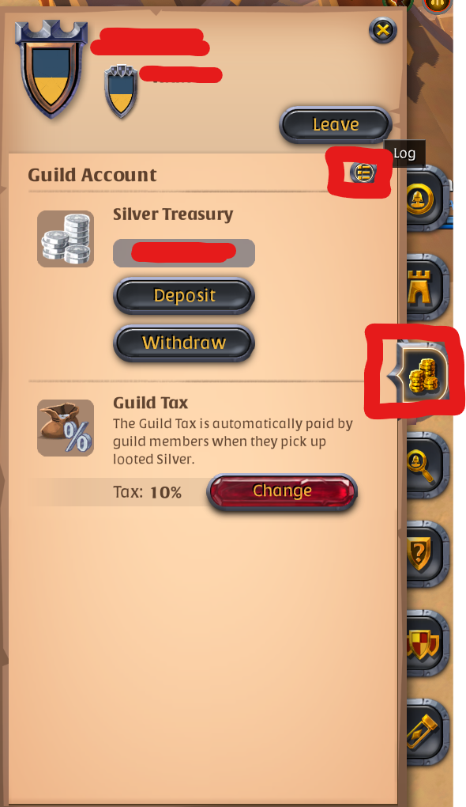
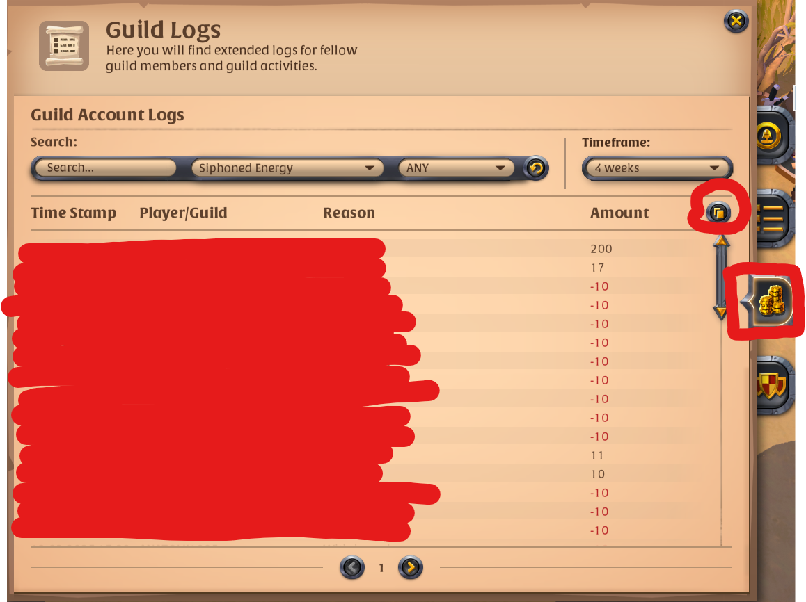
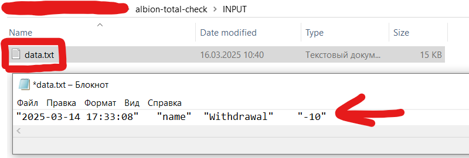
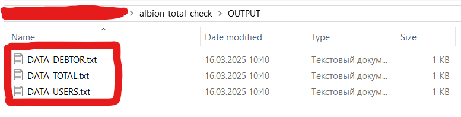

# Ablion total check

<span style="color:red;">
    <b>
       XLSX work with NODE only
    </b>
</span>

## Table of contents

- [Overview](#overview)
- [Structure](#folders-structure)
- [Getting](#getting-started)
- [Setup](#setup)
- [text instruction](/README.txt)

## Getting Started

```bash
# start
npm i

#script run
npm run start
```

or

```
RUN.bat
```

or

```
albion-total-check.exe
```

## Setup

1. First `run` for `create` INPUT folder with data file.
2. Copy data from ALbion Online to `data.txt` file in INPUT folder.
3. `Run` script.
4. Check results in OUTPUT folder.

## Folders structure

1. INPUT:

- data.txt - Enter here data from albion online.

2. OUTPUT:

- `DATA_DEBTOR.txt`- only the column of debtors.
- `DATA_TOTAL.txt` - only a common column with all users.
- `DATA_USERS.txt` - structured table with all the calculated data.

3. temp (DON`T touch):

- `energy.json` minor file for temp data.

## Overview



<br>


